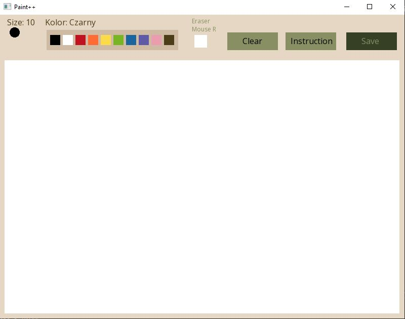
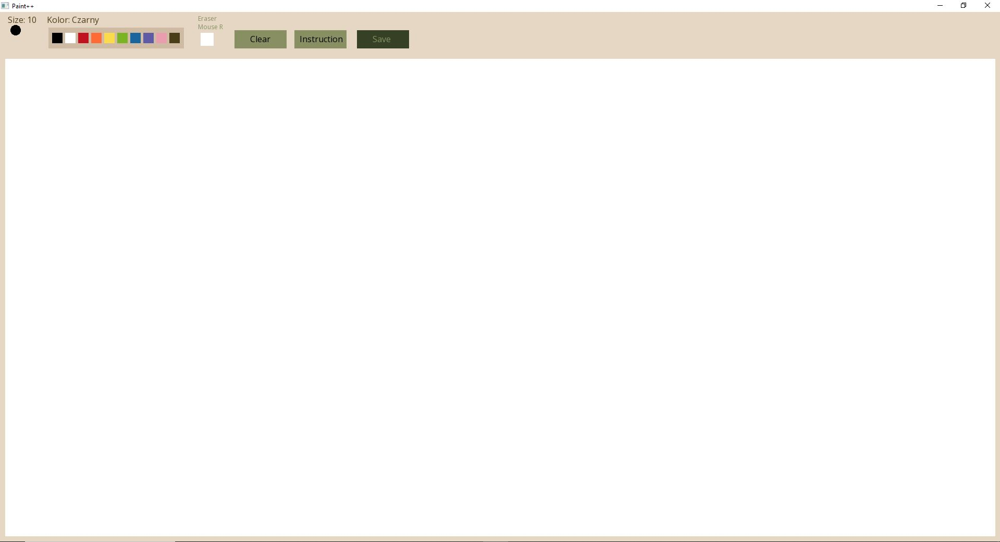
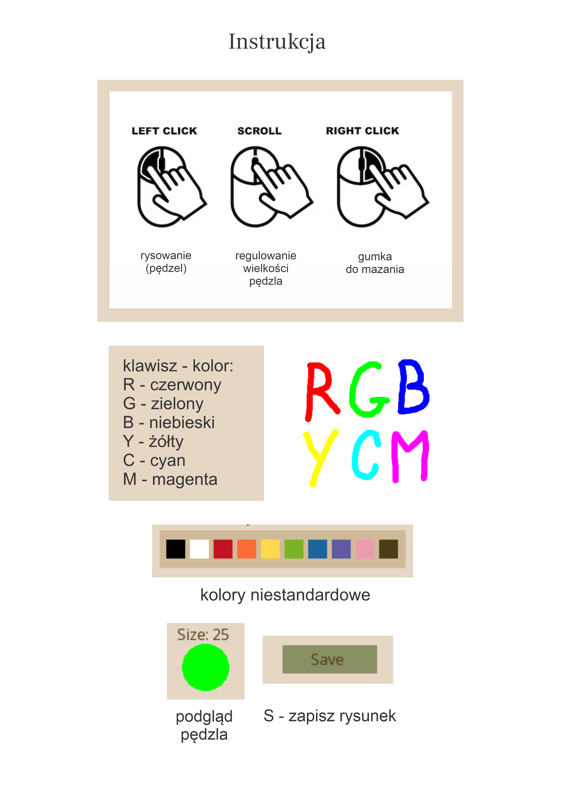

# Edytor graficzny

Prosty edytor graficzny zawierający podstawowe funkcje umożliwiające rysowanie.
Napisany w języku C++, przy pomocy biblioteki SFML (wersja 2.5.1).

## Wygląd programu

### Tryb okienkowy:

### Tryb pełnoekranowy:

## Instrukcja

Instrukcję można uruchomić przyciskiem "Instruction" znajdującym się na pasku narzędzi.

## Przykładowe prace wykonane w programie

